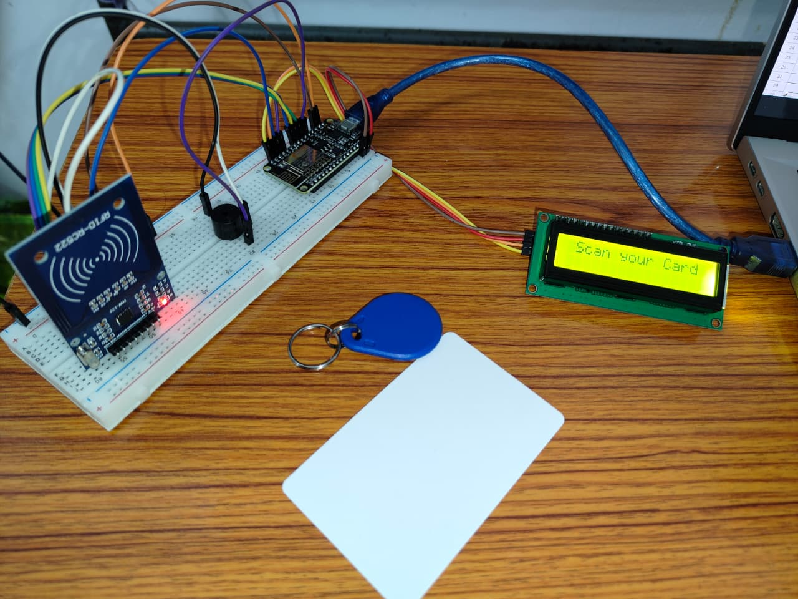
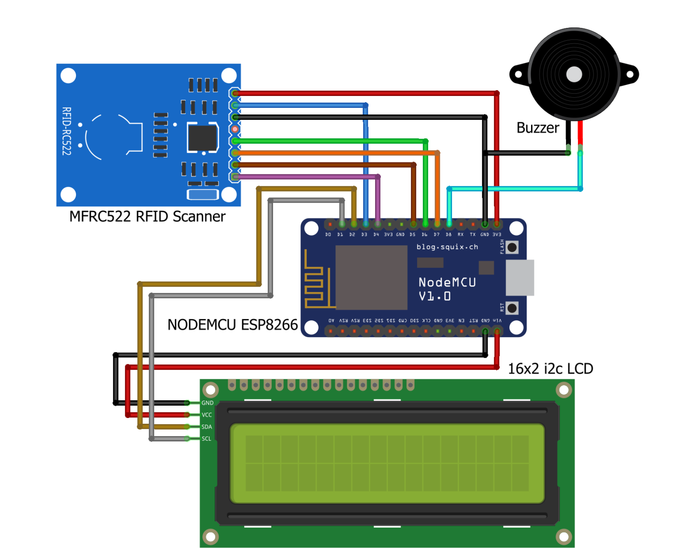

# 📚 Smart Attendance System using RFID

A **Smart Attendance System** built using **ESP8266 + RFID + Google Sheets**.  
This project automatically records attendance when an RFID card is scanned and updates it directly into **Google Sheets** 📊 using **Google Apps Script**.

---

## ⚡ Features
- ✅ Automatic attendance tracking  
- ✅ Google Sheets integration (real-time updates)  
- ✅ Easy RFID card registration  
- ✅ LCD display support for live feedback  
- ✅ WiFi-enabled (ESP8266)  

---

## 🛠️ Hardware Required
- 🔹 ESP8266 NodeMCU  
- 🔹 MFRC522 RFID Reader  
- 🔹 RFID Cards/Tags  
- 🔹 16x2 LCD Display (with I2C module recommended)  
- 🔹 Jumper wires & breadboard  

---

## 💻 Software Required
- Arduino IDE with libraries:  
  - `ESP8266WiFi.h`  
  - `ESP8266HTTPClient.h`  
  - `MFRC522.h`  
- Google Apps Script (in Google Sheets).  

---

## 📂 Repository Contents
- **`RFID_Card_Name_Tag.ino`** → Register RFID card IDs with user names.  
- **`RFID_Attendance_GoogleSheets.ino`** → Main attendance code (updates Google Sheets).  
- **`Apps Script.txt`** → Google Apps Script for handling API requests.  
- **`readme.md`** → Project documentation.  

---

## Images



---

## 🔧 Setup & Workflow

### 1️⃣ Circuit Connection
Connect the hardware as per the circuit diagram (ESP8266 + RFID + LCD).  


---

### 2️⃣ Register RFID Cards
1. Upload **`RFID_Card_Name_Tag.ino`** to your ESP8266.  
2. Open the Serial Monitor and scan new RFID cards.  
3. Copy the UID and map it with a name (e.g., `1234ABCD = John Doe`).  

---

### 3️⃣ Attendance Logging
1. Upload **`RFID_Attendance_GoogleSheets.ino`** to ESP8266.  
2. When a registered card is scanned, the system:  
   - Shows the name on LCD 🖥️  
   - Sends attendance data to Google Sheets 📊  

---

### 4️⃣ Google Sheets Setup
1. Open a Google Sheet → `Extensions` → `Apps Script`.  
2. Copy the script from **`Apps Script.txt`**.  
3. Deploy as **Web App** → set access to *Anyone with link*.  
4. Copy the Web App URL and paste it inside `RFID_Attendance_GoogleSheets.ino`.  

---

## 🚀 How to Run
1. Clone this repo:
   ```bash
   git clone https://github.com/your-username/smart-attendance-rfid.git
   ```
2. Install required Arduino libraries.

3. Upload the card registration code → register tags.

4. Upload the attendance code → start scanning.

5. Check Google Sheets → attendance updates in real-time 🎉.


